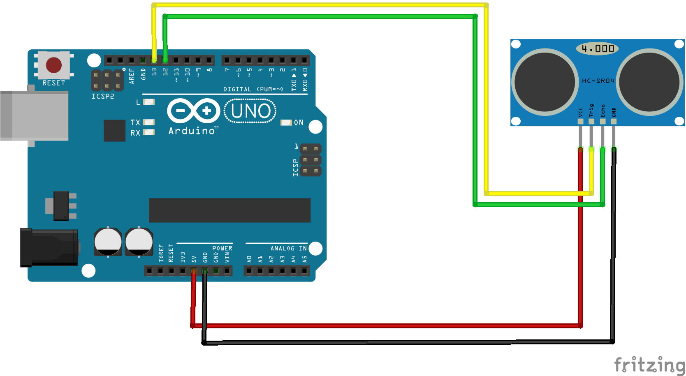

## Arduino Project With HCSR04 Ultrasonic Sensor

### What You Need
- Arduino Uno R3
- HCSR04 Ultrasonic Sensor
- Jumper Cable
- [HCSR04 Ultrasonic](../Libraries/HCSR04-by-Martin-Sosic.zip) or you can use `Library Manager` and search `HCSR04 by Martin Sosic` 

### Schematic and Wiring

| HCSR04 | Arduino | Cable Color |
| ------ | ------- | ----------- |
| VCC    | 5V      | Red         |
| GND    | GND     | Black       |
| Trig   | D13     | Yellow      |
| Echo   | D12     | Green       |

### Source Code
```arduino
/*
 * Libranies Name: HCSR04 by Martin Sosic
 * VCC HCSR04 to 5V Arduino
 * GND HCSR04 to GND Arduino
 * Trig Pin HCSR04 to D13 Arduino
 * Echo Pin HCSR04 to D12 Arduino
*/

// Libraries
#include <HCSR04.h>

// Declare Pin
int triggerPin = 13;
int echoPin = 12;

// Initialize Libraries
UltraSonicDistanceSensor distanceSensor(triggerPin, echoPin);

void setup () {
    Serial.begin(9600);
}

void loop () {
    Serial.println(distanceSensor.measureDistanceCm());
    delay(500);
}
```

### Reference / Credit
