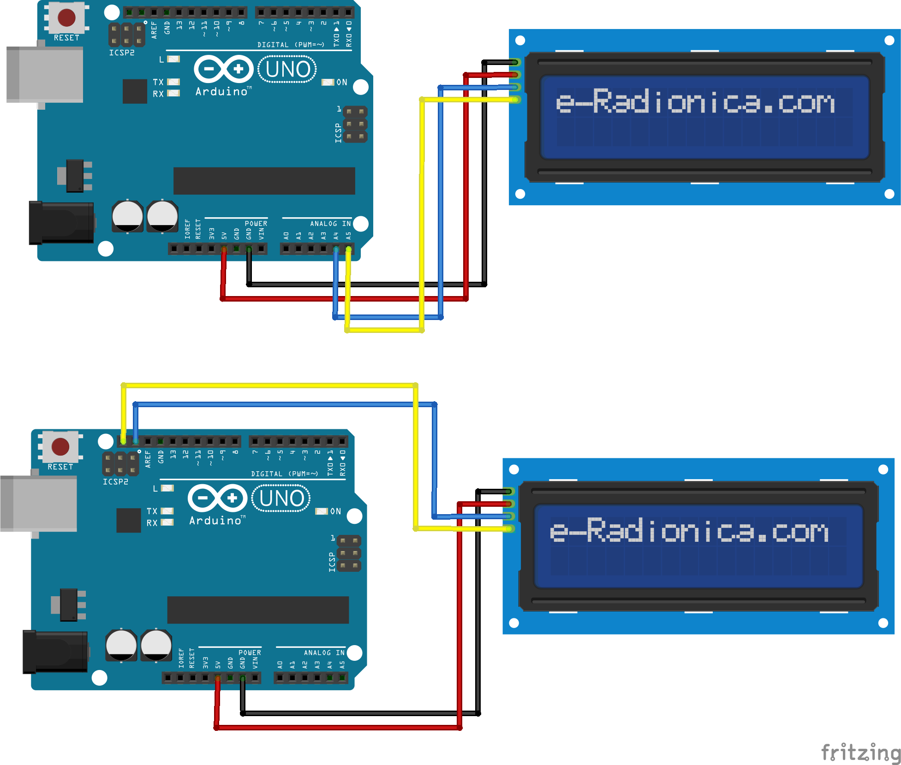

## Arduino Project With LCD 16x2

### What You Need
- Arduino Uno R3
- LCD 16x2 with I2C Module
- Jumper Cable
- [LCD_I2C Libraries](../Libraries/Arduino-LiquidCrystal-I2C-library-master.zip)

### Schematic and Wiring

| LCD I2C | Arduino  | Cable Color |
| ------- | -------- | ----------- |
| GND     | GND      | Black       |
| VCC     | 5V       | Red         |
| SDA     | A4 / SDA | Blue        |
| SCL     | A5 / SCL | Yellow      |

Note:
In LCD I2C, SDA and SCL pin can connect to A4 and A5 pin or SDA and SCL pin in Arduino

### Source Code
```arduino
/*
 * GRD I2C to GRD Arduino
 * VCC I2C to 5V Arduino
 * SDA I2C to SDA / A4 Arduino
 * SCL I2C to SCL / A5 Arduino
*/

// Libraries
#include <LiquidCrystal_I2C.h>

// Initialize Libraries
LiquidCrystal_I2C lcd(0x27, 16, 2);

void setup() {
  lcd.begin();
}

void loop() {
  lcd.setCursor(0, 0);
  lcd.print("HELLO WORLD");
}
```

### Reference / Credit
- [Cara Simple Program LCD i2C 16x2 Menggunakan Arduino](https://kelasrobot.com/cara-simple-program-lcd-i2c-16x2-menggunakan-arduino/)