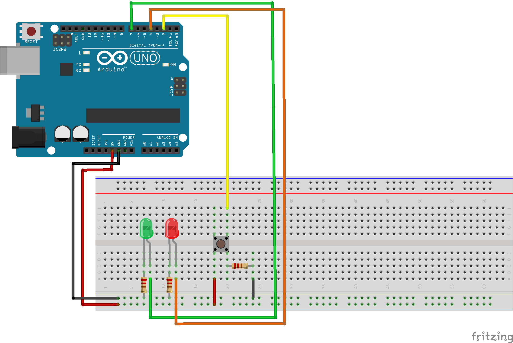

## Arduino Project With Push Button

### What You Need
- Arduino Uno R3
- Resistor (220 Ohm)
- LED (Red and Green)
- Push Button
- Jumper Cable

Note: You can use another color of LED

### Schematic and Wiring

Wiring:
* 5V Arduino to Positive Rail Breadboard
* GND Arduino to Negative Rail Breadboard
* Cathode LED Green to Negative Rail Breadboard (Connected by Resistor)
* Anode LED Green to D7 Arduino 
* Cathode LED Red to Negative Rail Breadboard (Connected by Resistor)
* Anode LED Red to D4 Arduino
* Pin 4 Push Button to Positive Rail Breadboard
* Pin 2 Push Button to Negative Rail Breadboard (Connected by Resistor)
* Pin 1 Push Button to D2 Arduino

### Source Code
```arduino
/*
 * 5V Arduino to Positive Rail Breadboard
 * GND Arduino to Negative Rail Breadboard
 * Cathode LED Green to Negative Rail Breadboard (Connected by Resistor)
 * Anode LED Green to D7 Arduino 
 * Cathode LED Red to Negative Rail Breadboard (Connected by Resistor)
 * Anode LED Red to D4 Arduino
 * Pin 4 Push Button to Positive Rail Breadboard
 * Pin 2 Push Button to Negative Rail Breadboard (Connected by Resistor)
 * Pin 1 Push Button to D2 Arduino
*/

// Declare Pin
int btnPin = 2;
int ledPinR = 4;
int ledPinG = 7;

void setup() {
  // Initialize LED and Button
  pinMode(btnPin, INPUT);
  pinMode(ledPinR, OUTPUT);
  pinMode(ledPinG, OUTPUT);
}

void loop() {
  // Store a button state into variable
  int btnState = digitalRead(btnPin);

  if (btnState == HIGH) {
    digitalWrite(ledPinG, HIGH);
    digitalWrite(ledPinR, LOW);
  } else {
    digitalWrite(ledPinG, LOW);
    digitalWrite(ledPinR, HIGH);
  }
}
```

### Reference / Credit
- [Button](https://www.arduino.cc/en/Tutorial/BuiltInExamples/Button)