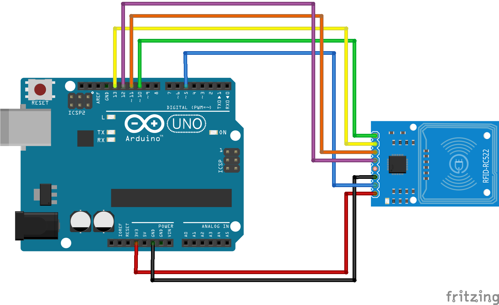

## Arduino Project With RFID RC522

### What You Need
- Arduino Uno R3
- RFID RC522
- RFID Tag
- Jumper Cable
- [RFID_RC522 Libraries](../Libraries/rfid.zip)

### Schematic and Wiring

| RFID RC522 | Arduino | Cable Color |
| ---------- | ------- | ----------- |
| GND        | GND     | Black       |
| 3V3        | 3.3V    | Red         |
| SDA        | 10      | Green       |
| MOSI       | 11      | Orange      |
| MISO       | 12      | Purple      |
| SCK        | 13      | Yellow      |
| RST        | 5       | Blue        |

### Source Code
```arduino
/*
 * 3V3 RFID to 3.3V Arduino
 * GND to GND Arduino
 * SDA to D10
 * MOSI to D11
 * MISO to D12
 * SCK to D13
 * RST to D5
*/

// Libraries
#include <SPI.h>
#include <MFRC522.h>

// Declare Pin
int SS_PIN = 10;
int RST_PIN = 5;

// Initialize Libraries
MFRC522 mfrc522(SS_PIN, RST_PIN);

void setup() 
{
  Serial.begin(9600);
  SPI.begin();
  mfrc522.PCD_Init();
}

void loop() 
{
  String content= "";
  byte letter;
  
  // Read ID Card
  if (!mfrc522.PICC_IsNewCardPresent()) 
  {
    return;
  }
  
  // Select Detected Card
  if (!mfrc522.PICC_ReadCardSerial()) 
  {
    return;
  }
  
  //Show Card ID on Serial
  Serial.print("UID tag: ");
  
  for (byte i = 0; i < mfrc522.uid.size; i++) 
  {
     Serial.print(mfrc522.uid.uidByte[i] < 0x10 ? " 0" : " ");
     Serial.print(mfrc522.uid.uidByte[i], HEX);
     content.concat(String(mfrc522.uid.uidByte[i] < 0x10 ? " 0" : " "));
     content.concat(String(mfrc522.uid.uidByte[i], HEX));
  }
  
  Serial.println();
  content.toUpperCase();
  delay(2000);
}
```

### Reference / Credit
- [Tutorial Pembacaan RFID Card dan Tag Input RFID-RC522 Menggunakan Arduino Uno R3](https://www.arduinoindonesia.id/2019/03/tutorial-pembacaan-rfid-card-dan-tag.html)
- [Cara Mudah Memprogram RFID MFRC522 Dengan Arduino](https://kelasrobot.com/cara-mudah-memprogram-rfid-mfrc522-dengan-arduino/)