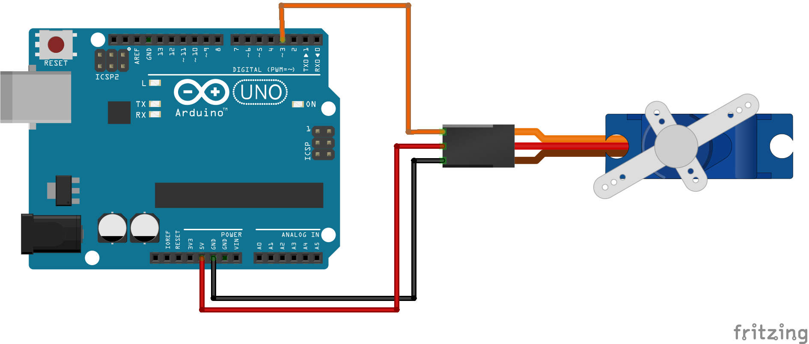

## Arduino Project With SG90 Tower Pro Servo

### What You Need
- Arduino Uno R3
- SG90 Tower Pro Servo
- Jumper Cable

### Schematic and Wiring

| SG90 Servo | Arduino | Cable Color |
| ---------- | ------- | ----------- |
| Input      | D3      | orange      |
| VCC        | 5V      | Red         |
| GND        | GND     | Black       |

### Source Code
```arduino
/*
 * Input SG90 to D3 Arduino
 * VCC SG90 to 5V Arduino
 * GND SG90 to GND Arduino
*/

// Libraries
#include <Servo.h>

// Initialize Libraries
Servo servo;  

// Declare Pin
int servoPin = 3;
int servoAngle = 0;
 
void setup()
{
  Serial.begin(9600);  
  servo.attach(servoPin);
}
 
void loop()
{
  servo.write(90);
  delay(1000);

  for(servoAngle = 90; servoAngle < 180; servoAngle++)
  {                                  
    servo.write(servoAngle);              
    delay(10);                  
  }
}
```

### Reference / Credit
- [Tutorial: How To Control the Tower Pro SG90 Servo with Arduino UNO](https://www.intorobotics.com/tutorial-how-to-control-the-tower-pro-sg90-servo-with-arduino-uno/)